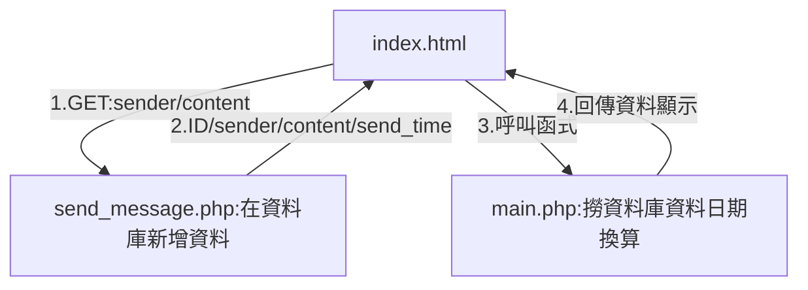
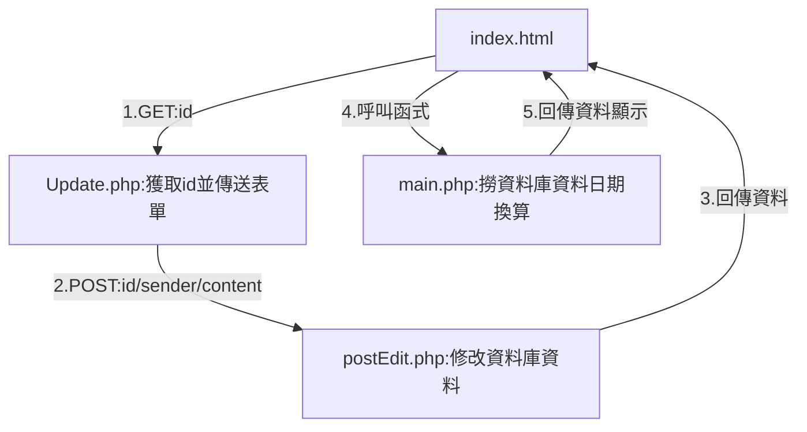
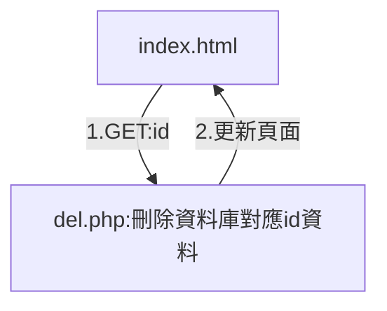
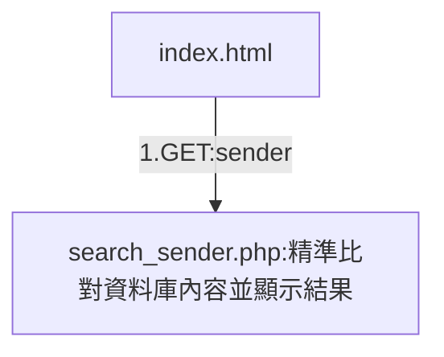
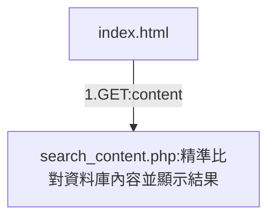

id:int(10) AI PK 

sender:varchar(10) NOT NULL

content:varchar(255) NOT NULL

send_time:varchar(100)

［新增］

id:自動編號

sender:必填/發佈人

content:必填/內容

send_time:系統當前時間

［修改］

［刪除］

［查詢］

#查詢人

sender:必填/發佈人

#查詢內容

content:必填/內容

